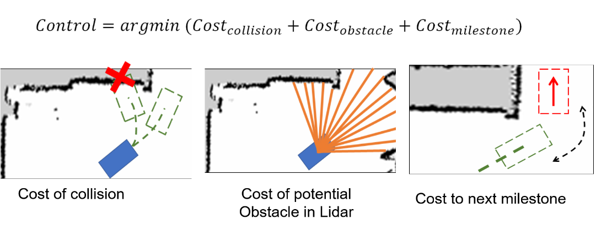

# CSE571_Project

## Overview
Our project is Delivery robot. In this project, we are trying to build a real-world robot that can handle the task of indoor delivery. More specifically, the robot can build the map in advance in unknown indoor environment. In addition, we expect the robot can start from any location and arrive at the destination given by users. The robot we used is from UW Mushr robot team (https://mushr.io/), thanks! 

Our system main components includes SLAM (http://wiki.ros.org/gmapping), PF localization (based on https://github.com/prl-mushr/mushr_pf), and path planning and motion planning (./auto_controller). The bottom-level driver of Mushr Robot is available in MushR official website https://github.com/prl-mushr 

## Technical details

### SLAM
Refer to https://mushr.io/

### Localization
Refer to https://github.com/prl-mushr/mushr_pf

### Path planning
We deploy configuration space method to help the planned path to keep a safe distance away from the wall, then A* algorihtm is applied to generate the sub-optimal global path.

### Motion planning
We firstly downsample the trajectory from A* and generate several milestones.
we apply the sampling-based motion planning. 
Specifically, after each control interval, the robot samples several available control option. For each option, a cost function is calculated and the robot would pick up the control with lowest cost.

Our cost function is composed of three parts. First is the cost of collision to evaluate the whether the future trajectory will hit the wall in the map. Secondly, the cost of lidar obstacle utilizes the current lidar data to guide the robot to select the safe direction far from the potential obstacles or dynamic obstacles.  Thirdly, the cost to next milestone aims to guide the robot to move to the next milestone and finally approach the destination.

