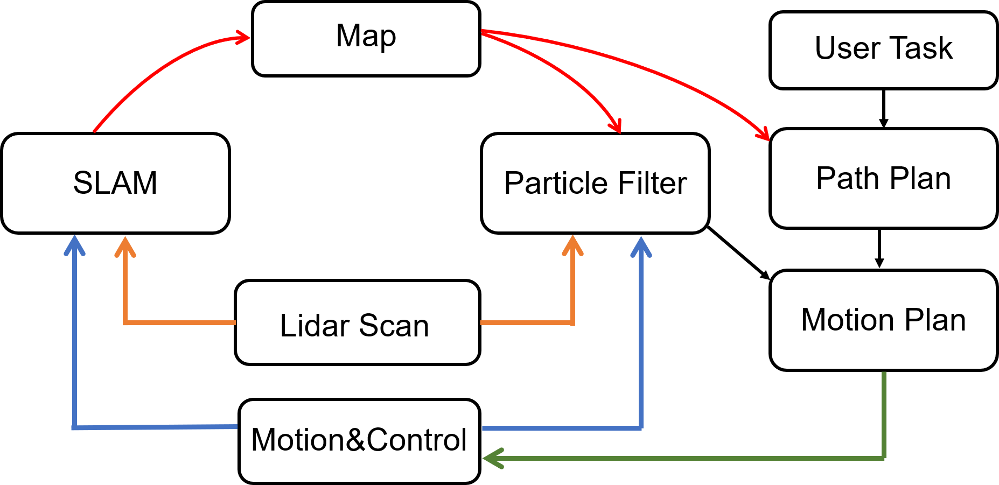

# CSE571_Project

## Overview
Our project is Delivery robot. In this project, we are trying to build a real-world robot that can handle the task of indoor delivery. More specifically, the robot can build the map in advance in unknown indoor environment. In addition, we expect the robot can start from any location and arrive at the destination given by users. The robot we used is from UW Mushr robot team(), thanks! 
